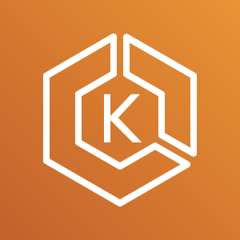

# EKS Logging Workshop

많은 기업들이 Monolithic Architecture에서 Container 기반의 Microservice Architecture로 전환하고 있습니다. 또한 container orchestration tool인 EKS에서 Log를 사용하여 시스템의 가시성(Observability)을 확보하는 것은 매우 중요합니다. 이 워크샵에서는 EKS의 Observability를 확보할 수 있는 방법들을 알아보고 AWS의 Data Pipeline 서비스인 Kinesis를 활용하여 각 카테고리의 최적화된 사용자 정의 데이터를 수집하는 architecture pattern을 알아보겠습니다. 이를 통해서 다양한 워크로드에 맞는 data pipeline을 구성하는 방법에 대해 insight를 얻을 수 있을 것입니다.

## 최종 Data Pipeline&#x20;

이 워크샵에서는 다음과 같은 아키텍처를 구성합니다. 대표적으로 3가지 방법으로 로깅 파이프라인을 구현할 수 있다는 것을 볼 수 있습니다.&#x20;

* CloudWatch Logs로 데이터를 확인합니다.
* Kinesis를 통해 데이터를 S3 Bucket에 저장하고 Athena로 저장된 데이터를 분석합니다.
* Kinesis를 통해 데이터를 OpenSearch에서 분석합니다.

.png>)
