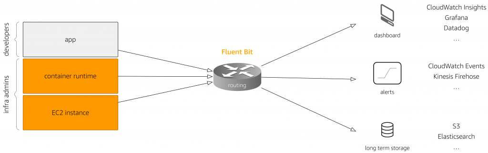

# Fluent Bit

.png>)

## Fluent Bit이란?

Fluent Bit은 오픈소스 및 다중 플랫폼 로그 처리자 및 전달자로서, 다양한 원본의 데이터 및 로그를 수집하고, 이를 통합하여 여러 대상에 전송할 수 있게 해 줍니다. Fluent Bit은 여러 대상으로 데이터를 보내는 데 사용할 수 있음으로 Kubernetes 같은 컨테이너 환경에서 매우 선호되는 로깅 솔루션입니다.

AWS용 Fluent Bit은 Fluent Bit 기반으로 하는 컨테이너이며 다양한 출력 대상에 대한 로그 필터, 파서 및 라우터로 설계되었습니다. Fluent Bit용 AWS는 Amazon CloudWatch, Amazon Kinesis Data Firehose 및 Amazon Kinesis Data Streams와 같은 AWS 서비스에 대한 지원을 추가합니다.

AWS Fluent Bit은 Fluent Bit 기반으로 하는 컨테이너이며 다양한 출력 대상에 대한 로그 필터, 파서 및 라우터로 설계되었습니다. 아래 log routing 그림과 같이 현재 AWS Fluent Bit으로 CloudWatch, S3, Athena, OpenSearch, Redshift 등과 통합할 수 있습니다.

Fluent Bit의 기능 및 특징에 대해 추가적으로 알고 싶다면 [여기 ](https://docs.fluentbit.io/manual)를 클릭하세요.

## CloudWatch Logs + Fluent Bit 로깅 아키텍처&#x20;

아래와 같은 Data Pipeline으로 로깅 아키텍처를 구축할 것입니다. &#x20;

 (1).png>)
