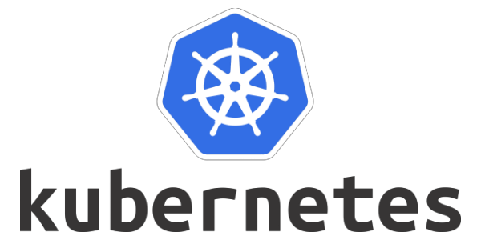

# Kubernetes(k8s) 개념

### Kubernetes란 무엇인가?

K8s는 컨테이너화된 워크로드와 서비스를 관리하기 위한 오픈소스 플랫폼으로, 선언적 구성과 자동화를 모두 지원하는 컨테이너 오케스트레이션 툴입니다. K8s는 이식성이 높고 확장 가능한 생태계를 가지고 있습니다.&#x20;

자세한 이론 설명은 Kubernetes.io [공식 사이트](https://kubernetes.io/)에서 확인할 수 있습니다.

### Kubernetes 컴포넌트

쿠버네티스 클러스터는 노드 컴포넌트와 컨트롤 플레인 컴포넌트로 구성됩니다.

#### Control Plane 컴포넌트

컨트롤 플레인 컴포넌트는 스케줄링 같은 클러스터에 관한 전반적인 결정을 수행하고 클러스터 이벤트를 감지하고 반응합니다.

#### Node 컴포넌트

노드 컴포넌트는 컨테이너화된 애플리케이션의 구성 요소인 파드를 유지시키고 쿠버네티스 런타임 환경을 제공합니다.

### Kubernetes API

K8s는 API 형식으로 k8s 오브젝트들의 상태를 쿼리하고 조작할 수 있습니다. API 서버는 최종 사용자, 클러스터의 다른 부분 그리고 외부 컴포넌트가 서로 통신할 수 있도록 HTTP API를 제공합니다. 대부분의 작업은 `kubectl` 커맨드 라인 인터페이스 또는 API를 사용하는 `kubeadm` 같은 커맨드 라인 툴을 통해 수행할 수 있습니다.   &#x20;

### Kubernetes Objects

K8s 오브젝트는 k8s 클러스터의 상태를 나타내는 영구 엔티티입니다. 오브젝트는 바라는 상태(desired state)를 나타내고 오브젝트를 생성하면 쿠버네티스의 컨트롤 플레인에서 오브젝트의 현재 상태(current state)와 바라는 상태를 일치시키기 위해 지속적으로 관리합니다.

K8s에서 제공하는 Object는 대표적으로 4가지가 있습니다.

* Pod
* Namespace
* Volume
* Service
