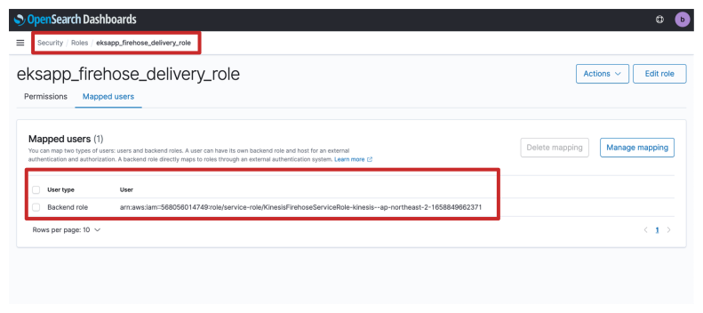

# Kinesis Firehose 생성

이전에 Firehose를 Data Stream에서 S3로 구성한 것 같이 OpenSearch를 위해 새로운 Delivery Stream을 구연해 봅니다. Data Stream은 이전에 구축한대로 변경하지 않고 오직 새로운 Delivery Stream을 생성합니다.

1 . AWS Console에 접속해 Kinesis 창에서 **Create Delivery Stream**을 클릭합니다.

2\. **Source**를 이전에 생성한 Kinesis Data Stream으로 설정하고 **Destination**은 OpenSearch로 설정합니다.

3\. **Delivery stream** 이름을 정하고 **Data Transformation**은 변경하지 않습니다.

4\. **OpenSearch Service domain**을 이전에 생성한 domain 서비스로 설정합니다. **Index** 이름을 정하고 **Index rotation**을 'Every hour'로 설정합니다.

5\. **Buffer size**: 5 MiB, **Buffer Interval**: 60 seconds로 정합니다.

6\. Fail된 데이터를 S3 Bucket로 보내도록 설정합니다. 이 S3 Bucket은 새로 생성해야 합니다.

7\. 나머지 설정은 default로 변경하지 않고 **Create delivery stream**을 클릭합니다.

## OpenSearch Role과 IAM Role 연결

생성된 Firehose가 OpenSearch에 데이터를 전달할 수 있게 Role Mapping을 실행합니다.

1\. Kibana에 접속한 후 Security 설정 창으로 들어갑니다.

2\. **Create new role**을 클릭합니다.

3\. Role의 이름을 정하고 2가지의 **Cluster permissions**을 포함합니다.

* _cluster\_composite\_ops_
* _cluster\_monitor_

4\. Firehose 생성할때 설정한 Index 이름을 적습니다. 3가지의 Index permissions을 포함합니다.

* _create\_index_
* _manage_
* _crud_

5\. **Create**을 클릭하여 다음과 같이 Role을 확인할 수 있습니다.

6\. AWS Console에서 방금 생성된 Firehose을 확인해 봅니다. **Permissions** 부분에 표시되어 있는 IAM Role을 클릭합니다.&#x20;

7\. **ARN**을 일시 복사합니다.

8\. 방금 Kibana에서 생성한 Role에 **Manage mapping**을 클릭해 복사한 ARN URL을 **Backend role**으로 설정합니다.

9\. **Map** 버튼을 클릭해 Firehose가 OpenSearch로 데이터를 보낼 수 있게 Role mapping 설정을 완료합니다.

