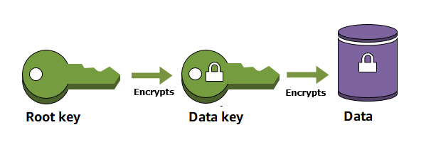

# KMS Key 생성

## AWS Key Management Service (KMS)



AWS KMS를 사용하면 손쉽게 암호화 키를 생성 및 관리하고 다양한 AWS 서비스와 애플리케이션에서의 사용을 제어할 수 있습니다. AWS KMS는 FIPS 140-2에 따라 검증되었거나 검증 과정에 있는 하드웨어 보안 모듈을 사용하여 키를 보호하는 안전하고 복원력이 있는 서비스입니다. 또한, AWS KMS는 AWS CloudTrail과도 통합되어 모든 키 사용에 관한 로그를 제공함으로써 각종 규제 및 규정 준수 요구 사항을 충족할 수 있게 지원합니다.

안전한 인증 관리를 위해 EKS에서 KMS를 사용하실 수 있습니다.

## KMS Key 생성

1\. Kubernetes Secret 암호화를 할 때, EKS 클러스터에서 사용할 KMS Key를 생성합니다.

```
aws kms create-alias --alias-name alias/eksapp --target-key-id $(aws kms create-key --query KeyMetadata.Arn --output text)

```

KMS Key를 AWS Console에서 확인할 수 있습니다.


2\. KMS Key의 ARN을 MASTER\_ARN에 입력해 둡니다.

```
export MASTER_ARN=$(aws kms describe-key --key-id alias/eksapp --query KeyMetadata.Arn --output text)

```

3\. MASTER\_ARN에 입력된 값을 조회하고, MASTER\_ARN의 값은 계속 사용되는 값이므로 홈디렉토리에 **`master_arn.txt`** 파일을 저장합니다.&#x20;

```
 cd ~/environment
 echo $MASTER_ARN
 echo $MASTER_ARN > master_arn.txt
 cat master_arn.txt
 
```

4\. KMS Key를 쉽게 참조 할 수 있도록 MASTER 환경변수를 bash\_profile에 저장합니다.

```
echo "export MASTER_ARN=${MASTER_ARN}" | tee -a ~/.bash_profile
source ~/.bash_profile

```
